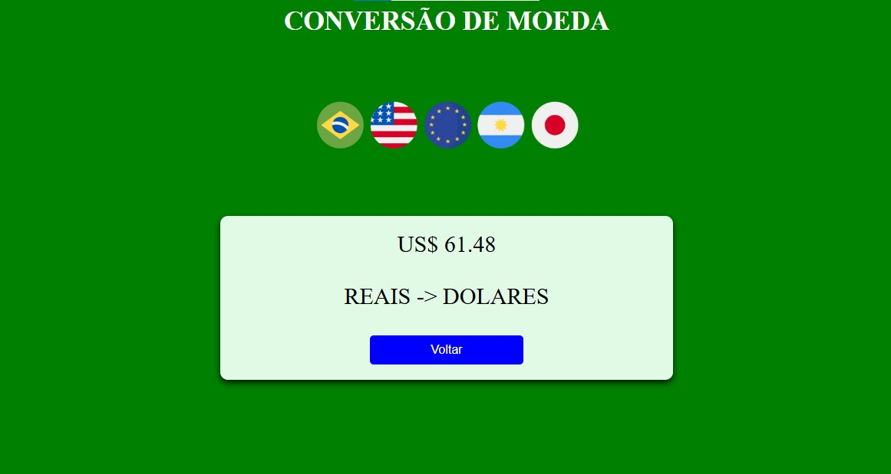

# Conversor de Moedas
 Este programa realiza a conversão de valores entre diferentes moedas, incluindo Real (BRL), Dólar Americano (USD), Euro (EUR), Peso Argentino (ARS), Iene Japonês (JPY) e Libra Esterlina (GBP).

 O usuário poderá digitar o valor desejado, a moeda em qual digitou a moeda em questão e a moeda para qual quer o resultado da conversão, sendo calculado automaticamente pelo site.

 O site apresenta interface intuitiva e de fácil compreensão, possibilitando ao usuário uma entrega rápida e fácil do serviço e resultado que procura.

## 📋 Índices 
- <a href="#funcionalidades"> Funcionalidades </a>
- <a href="#demonstracao"> Demonstração </a>
- <a href="#tecnologias"> Tecnologias Utilizadas </a>
- <a href="#utilidades"> Utilizades do Programa </a>

## 💻 Funcionalidades: 
- ✅ Conversão das 5 principais moedas do mercado;
- ✅ Interface intuitiva;
- ✅ Entrega de resultado(conversão) rápida e eficaz;

## 👨🏽‍💻 Demonstração: 
Primeira tela onde o usuário digitará o valor e qual moeda irá ser convertida:

Tela final, mostrando a conversão do valor digitado pelo usuário anteriormente pela moeda escolhida pelo próprio.

## 🛠 Tecnologias Utilizadas: 
- [HTML] - Linguagem de marcação de hipertexto;
- [CSS] - Define o estilo e layout das páginas HTML;
- [PHP](https://www.php.net) - Linguagem de programação utilizada.

## 📌 Utilidades do Programa: 
- ✅ Permite conversão rápida entre as principais moedas do mercado;

- ✅ O sistema pode ser usado para uma fonte de calculo rápido;

- ✅ O site é simples e fácil de usar, sem necessidade de cadastro;

- ✅ Funciona em qualquer navegador moderno.